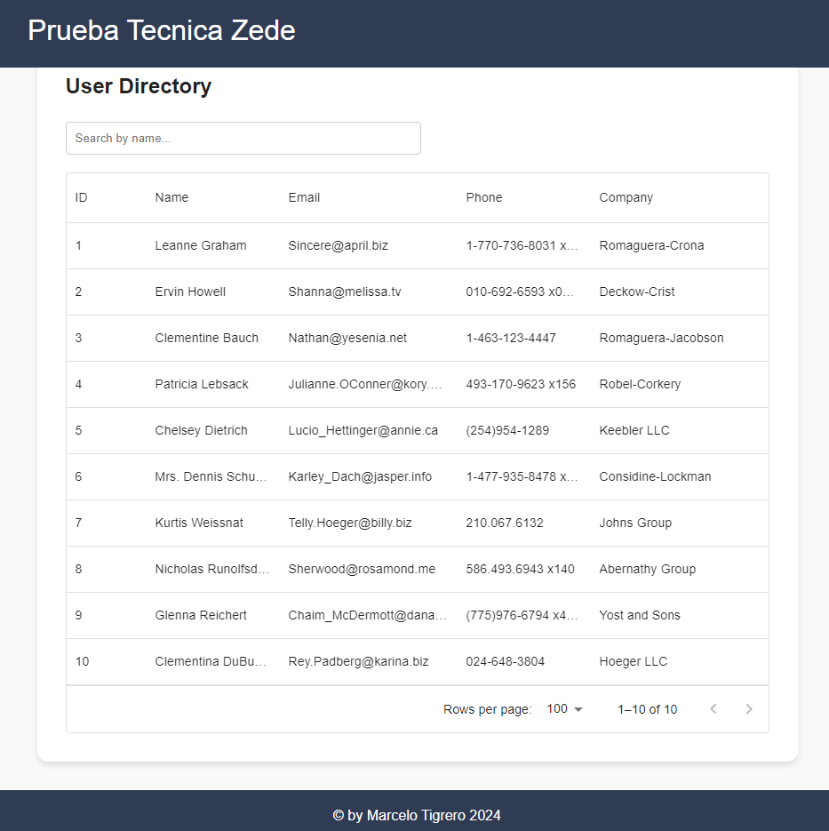
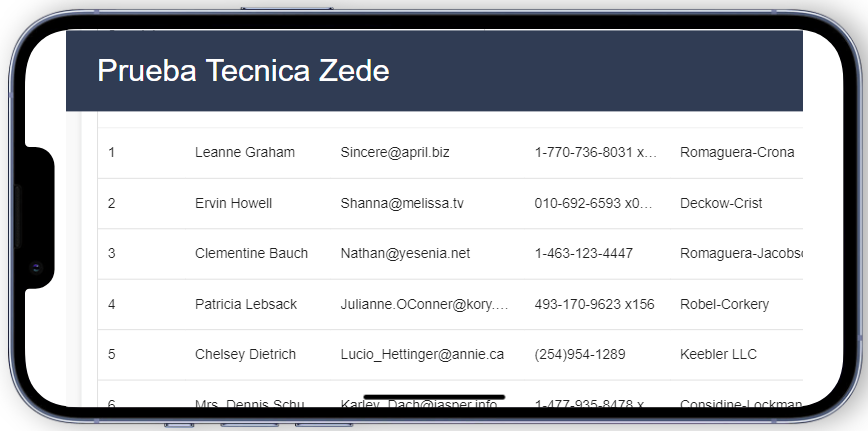
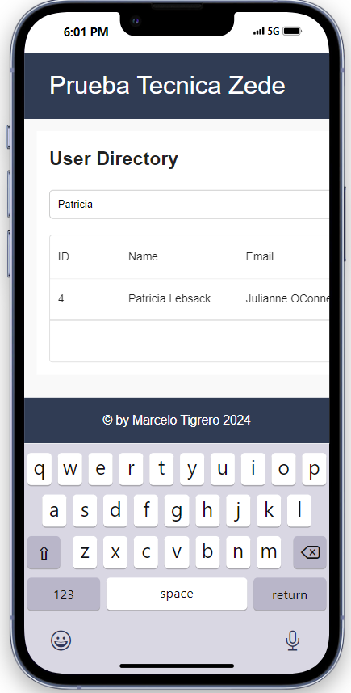

# Proyecto: Lista de Usuarios con Next.js y Material-UI

Este proyecto es una prueba técnica que utiliza **Next.js** y **Material-UI** para construir una tabla interactiva que muestra una lista de usuarios obtenida de una API pública. La aplicación incluye funcionalidad de búsqueda para filtrar usuarios por nombre y está diseñada para ser responsiva y fácil de usar.

---

## **Tabla de Contenidos**
1. [Descripción del Proyecto](#descripción-del-proyecto)
2. [Requisitos](#requisitos)
3. [Instalación y Configuración](#instalación-y-configuración)
4. [Ejecución del Proyecto](#ejecución-del-proyecto)
5. [Funcionamiento](#funcionamiento)
6. [Arquitectura del Proyecto](#arquitectura-del-proyecto)
7. [Captura de Pantalla](#captura-de-pantalla)
8. [Mejoras Futuras](#mejoras-futuras)
9. [Licencia](#licencia)

---

## **Descripción del Proyecto**

El objetivo principal de este proyecto es consumir una API pública para obtener una lista de usuarios y presentarlos en una tabla interactiva con **Material-UI DataGrid**. Los usuarios pueden buscar por nombre en tiempo real utilizando un campo de búsqueda. Además, el proyecto incluye configuraciones para ejecutarse localmente o en un contenedor Docker.

---

## **Requisitos**

- **Node.js**: Versión 20-alpine.
- **Docker** (opcional): Para ejecutar el proyecto en un contenedor aislado.

Dependencias principales utilizadas:
- **Next.js**: Framework para aplicaciones React.
- **Material-UI**: Para diseño de interfaz.
- **React** y **@mui/x-data-grid**: Para renderizar la tabla interactiva.

---

## **Instalación y Configuración**

### **1. Clonar el Repositorio**
Clona el repositorio en tu máquina local:
```bash
git clone <url-del-repositorio>
cd <nombre-del-proyecto>
```

### **2. Instalar Dependencias**
Instala las dependencias necesarias para el proyecto:
```bash
npm install
```

---

## **Ejecución del Proyecto**

### **Ejecución Local**
Para iniciar el servidor en tu máquina local:
```bash
npm run dev
```

La aplicación estará disponible en [http://localhost:3000](http://localhost:3000).

### **Ejecución con Docker**
Si prefieres ejecutar el proyecto dentro de un contenedor Docker, asegúrate de tener `docker` y `docker-compose` instalados. Luego ejecuta:
```bash
docker-compose up --build
```

La aplicación estará disponible en el mismo puerto: [http://localhost:3000](http://localhost:3000).

---

## **Funcionamiento**

### **1. Flujo de Datos**
1. **API Externa**: Los datos se obtienen de [https://jsonplaceholder.typicode.com/users](https://jsonplaceholder.typicode.com/users).
2. **API Interna**: Un endpoint interno (`/api/users`) procesa los datos para manejar errores y añadir flexibilidad.
3. **Tabla Interactiva**: Los datos se muestran en una tabla con columnas que incluyen:
   - ID
   - Nombre
   - Correo Electrónico
   - Teléfono
   - Empresa
4. **Búsqueda Dinámica**: Los usuarios pueden buscar por nombre, actualizando la tabla en tiempo real.

### **2. Interfaz de Usuario**
- **Material-UI DataGrid**: La tabla es interactiva, con soporte para paginación y diseño responsivo.
- **Barra de Búsqueda**: Un campo de entrada para buscar usuarios por nombre.

---

## **Arquitectura del Proyecto**

El proyecto sigue una arquitectura modular y escalable:

```plaintext
my-app/
├── src/
│   ├── components/         # Componentes reutilizables
│   │   ├── DataTable.js    # Componente para la tabla de datos
│   │   ├── SearchBar.js    # Componente para el campo de búsqueda
│   ├── pages/              # Páginas del proyecto
│   │   ├── _app.js         # Configuración global del proyecto
│   │   ├── index.js        # Página principal
│   │   └── api/            # APIs internas
│   │       └── users.js    # Endpoint interno para consumir la API externa
│   ├── styles/             # Archivos de estilos
│   └── utils/              # Funciones auxiliares
│       └── fetchData.js    # Lógica para obtener datos desde la API externa
├── package.json            # Información del proyecto y dependencias
├── Dockerfile              # Configuración de Docker
├── docker-compose.yml      # Orquestación de contenedores Docker
└── README.md               # Documentación del proyecto
```

---

## **Captura de Pantalla**

### **Vista en Web**


### **Vista en Móvil**


### **Funcionalidad de Búsqueda**


---

## **Mejoras Futuras**

### **1. Paginación Dinámica**
- Agregar soporte para grandes volúmenes de datos.

### **2. Autenticación**
- Implementar autenticación para proteger el acceso a los endpoints internos.

### **3. Caché**
- Utilizar un sistema como Redis para almacenar respuestas de la API y mejorar el rendimiento.

### **4. Manejo de Errores Avanzado**
- Mostrar mensajes más claros y detallados en caso de fallos.

---

## **Licencia**

Este proyecto está disponible bajo la licencia MIT.
